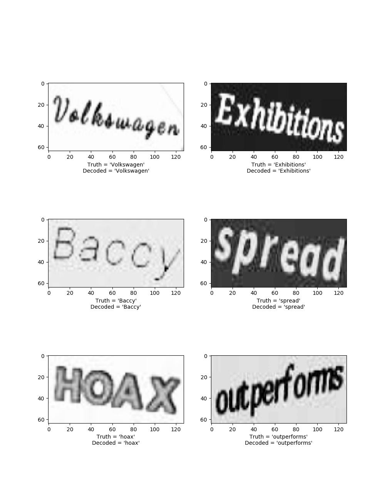

# Image sequence Recognition

Keras-based CNN+LSTM trained with CTC-loss for OCR and research paper [link](https://arxiv.org/pdf/1507.05717.pdf)


This Figure use first CNN for exraction and use LSTM for sequence generation with special CTC loss.


# Environment
- python==3.6
- keras== 2.2.4 
- tensorflow=> 1.8 
- cairocffi
- editdistance

# Dataset

Downlaod synthesis dataset [90kDICT32px](http://preon.iiit.ac.in/~scenetext/codendatasets/index.html)
OR 
synthesis Data Generate use ```thesis_data_generation_v3.py``` English wiki dataset.

Note plase download ```Roboto-Regular.ttf``` and add font directory in line number 36.

### pretrain model
#### This model  use 3k image data for training and 3k random select from 90kDICT32px
- RCNNMode_v2.ipython [model](https://drive.google.com/open?id=13utyxPpVqa5QCkJQjoj4r264QSoh_7Xd) link
#### Below this model use 10k synthesis data for training
- Pretrain [model](https://drive.google.com/file/d/1Af5wTtqxyeODyFaHT-uNnFvIIT1u2sOK/view?usp=sharing)

# Experiment 
## Train
Make Sure your dataset path and run``` train.py ```script

## Test
- First model was train 3k images data from 90kDICT32px
- Second model was train synthesis 10k images data

Make sure your train model path and test image sample and run ```prediction.py``` script.


#### Validation Result,




# Contributor
- Saiful Islam
